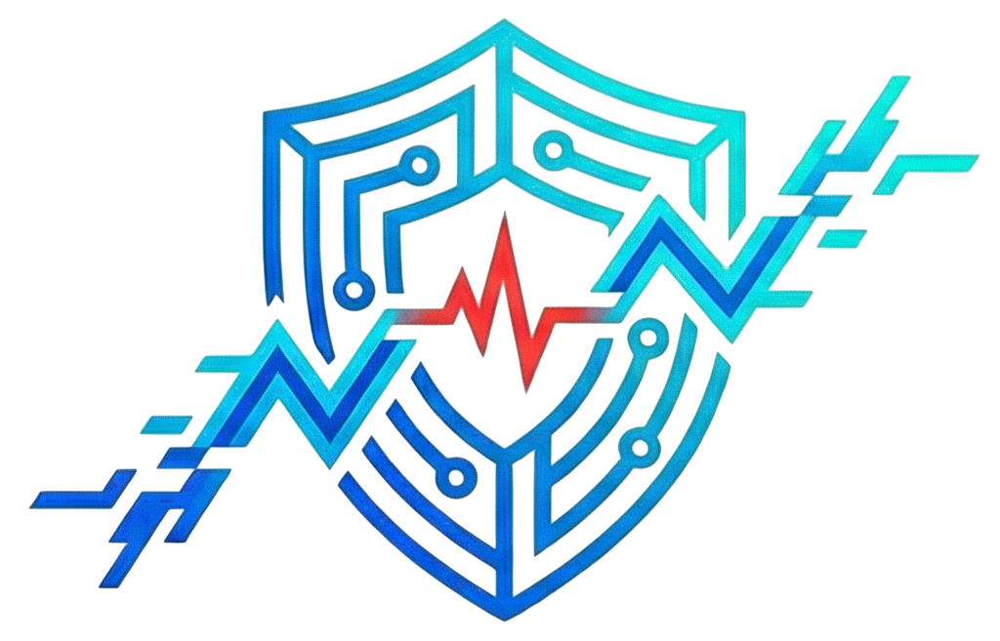

# Satark-AI: Defending Truth in the Age of Generative AI 🛡️


[](https://satark-ai.vercel.app)
[](https://react.dev)
[](https://fastapi.tiangolo.com)
[](https://speechbrain.github.io)
[](LICENSE)

**Satark-AI** is a cutting-edge deepfake detection and speaker verification platform. It leverages advanced audio analysis techniques (MFCC, Spectral Analysis) and Deep Learning models to identify synthetic media and verify speaker identities in real-time.

---

## 🌟 Key Features

### 🕵️‍♂️ Deepfake Detection

- **Advanced Audio Forensics**: Analyzes spectral patterns and compression artifacts invisible to the human ear.
- **Multi-Format Support**: Upload MP3, WAV, or extract audio from MP4 videos.
- **Explainable AI (XAI)**: Provides detailed confidence scores and heatmaps.

### 🆔 Voice Biometrics (Speaker Identity)

- **Enrollment System**: Create secure voice prints for known speakers.
- **Verification**: Match audio against enrolled identities with high precision using `ECAPA-TDNN` embeddings.

### 🎙️ Live Monitor

- **Real-Time Protection**: Continuously monitors microphone input (e.g., during calls).
- **Chunk Analysis**: Processes audio in 5-second intervals for instant feedback.
- **Auto-Persistence**: Saves all threats to a secure history database.

### 📱 Experience & Accessibility

- **Progressive Web App (PWA)**: Installable on Mobile and Desktop.
- **History & Playback**: Review past scans, listen to audio, and download PDF reports.
- **Smart Deduplication**: Prevents redundant processing using SHA-256 file hashing.

---

## 🏗️ Architecture

The project is built as a highly scalable **Monorepo** using **Turborepo**:

- **Frontend (`apps/web`)**: Next-gen UI built with **React**, **Vite**, **Tailwind CSS**, and **Framer Motion**.
- **API Gateway (`apps/api`)**: **Node.js** with **Hono** framework for high-performance routing and **Drizzle ORM** for database management.
- **AI Engine (`apps/engine`)**: **Python** service running **FastAPI**, **PyTorch**, and **SpeechBrain** for heavy inference.

---

## 🚀 Getting Started

### Prerequisites

- Node.js (v18+)
- Python (3.10+)
- PostgreSQL

### Installation

1.  **Clone the Repository**

    ```bash
    git clone https://github.com/theunstopabble/Satark-AI.git
    cd Satark-AI
    ```

2.  **Install Dependencies**

    ```bash
    npm install
    ```

3.  **Setup AI Engine**

    ```bash
    cd apps/engine
    pip install -r requirements.txt
    ```

4.  **Configure Environment**
    - Create `.env` files in `apps/web` (`VITE_CLERK_KEY`), `apps/api` (`DATABASE_URL`), and `apps/engine`.

### Running Locally

Open 3 terminals to start the microservices:

1.  **Frontend**:
    ```bash
    cd apps/web && npm run dev
    ```
2.  **API**:
    ```bash
    cd apps/api && npm run dev
    ```
3.  **AI Engine**:
    ```bash
    cd apps/engine
    # Activate venv if used
    python -m uvicorn main:app --reload --port 5500
    ```

---

## 📸 Screenshots

|                                     Dashboard                                     |                                   Mobile View                                   |
| :-------------------------------------------------------------------------------: | :-----------------------------------------------------------------------------: |
|  _Replace with dashboard screenshot_ |  _Replace with mobile screenshot_ |

_(Note: The banner above showcases the actual UI)_

---

## 🤝 Contributors

- **Gautam Kumar** - _Lead Developer_ - [LinkedIn](https://www.linkedin.com/in/gautamkr62/) | [GitHub](https://github.com/theunstopabble)

---

## 📄 License

This project is licensed under the MIT License - see the [LICENSE](LICENSE) file for details.

---

<div align="center">
  <strong>Made with ❤️ in India 🇮🇳</strong>
</div>
