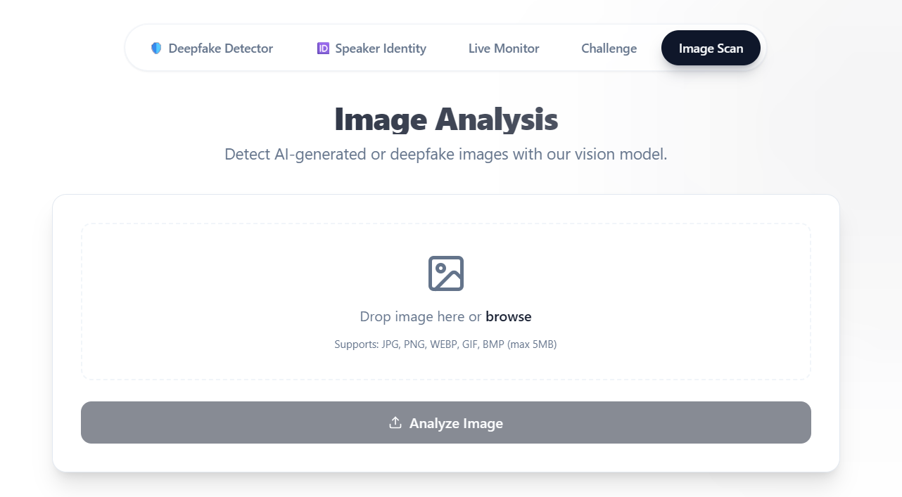
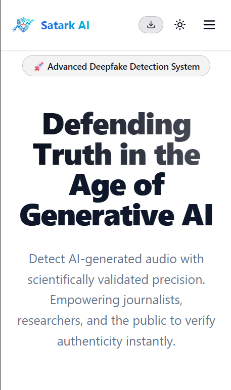
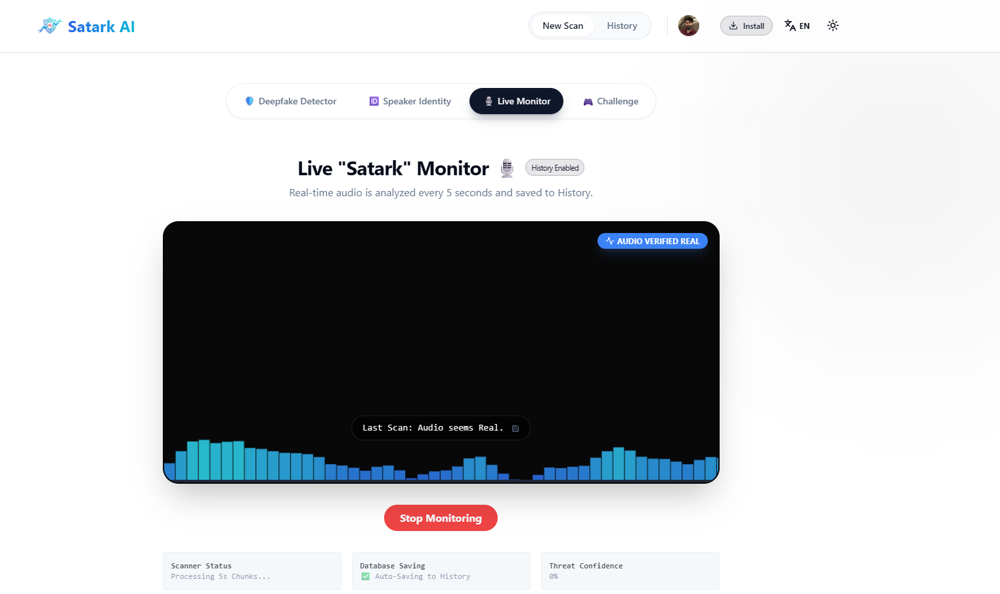
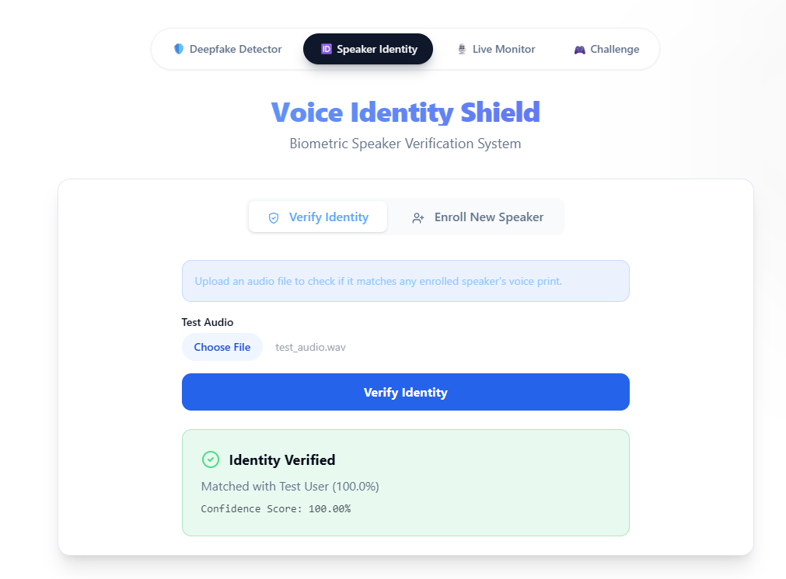

# Satark-AI: Defending Truth in the Age of Generative AI 🛡️

<div align="center">
  
</div>

<div align="center">

[](https://satark-ai.vercel.app)
[](https://react.dev)
[](https://fastapi.tiangolo.com)
[](https://hono.dev)
[](https://speechbrain.github.io)
[](https://turbo.build)
[](LICENSE)
[](docker-compose.yml)

</div>

---

## 🌐 Live Demo

👉 **[Open Live App → satark-deepfake.vercel.app](https://satark-deepfake.vercel.app/)**

**Satark-AI** is a production-grade, full-stack deepfake detection and voice biometrics platform. It uses a dual-model AI pipeline combining **Wav2Vec2 transformer inference** with **spectral heuristic analysis** for audio deepfake detection, and **ECAPA-TDNN embeddings** via SpeechBrain for speaker identity verification — all served through a secure, authenticated microservice architecture.

---

## 📸 Screenshots

|                     Dashboard                      |                   Mobile View                    |
| :------------------------------------------------: | :----------------------------------------------: |
|  |  |

|                 Live Monitor                 |              Speaker Identity               |
| :------------------------------------------: | :-----------------------------------------: |
|  |  |

---

## 🌟 Key Features

### 🕵️‍♂️ Audio Deepfake Detection

- **Dual-Model AI Pipeline**: Primary Wav2Vec2 transformer (70% weight) combined with spectral heuristics (30% weight) for composite confidence scoring.
- **Multi-Format Support**: Upload MP3, WAV, OGG, WebM, or extract audio from MP4/MOV video files (via MoviePy).
- **URL & File Modes**: Scan audio directly from public URLs or upload local files up to 50MB.
- **Explainable AI (XAI)**: Detailed per-segment heatmap, MFCC spectral chart, ZCR / Silence Ratio / Rolloff forensic metrics.
- **Smart Deduplication**: SHA-256 file hashing prevents redundant AI processing — cached results load instantly.

### 🖼️ Image Deepfake Detection

- **Cloud-Powered**: Proxied through a Cloudflare Worker to **NVIDIA NIM Vision API (Llama 3.2 90B)** for visual deepfake analysis.
- **Model Loading Awareness**: Handles cold-start delays with user-friendly retry prompts (`503` with `retryAfter: 15`).

### 🆔 Voice Biometrics (Speaker Identity)

- **Enrollment System**: Record or upload audio to create a 192-dimensional voice embedding (ECAPA-TDNN).
- **Verification**: Cosine similarity matching (threshold: `0.75`) against all enrolled identities for the authenticated user.
- **Isolated Profiles**: Each user can only match against their own enrolled speakers — zero cross-user data leakage.

### 🎙️ Live Monitor

- **Real-Time Protection**: Continuously captures microphone input and analyzes it in **5-second chunks**.
- **Auto-Retry**: Up to 3 automatic retries on connection failures before graceful shutdown.
- **Auto-Persistence**: All detected threats are automatically saved to scan history in PostgreSQL.
- **Visual Threat Indicator**: Canvas-based oscilloscope with color-coded threat level bar.

### 📱 Experience & Accessibility

- **Progressive Web App (PWA)**: Installable on mobile and desktop — works offline with Workbox caching.
- **Bilingual UI**: Full English 🇬🇧 and Hindi 🇮🇳 language support with `localStorage` persistence.
- **Dark / Light / System Theme**: Persistent theme toggle via CSS variables and Tailwind dark mode.
- **History & Playback**: Review all past scans, play back uploaded audio (authenticated streaming), and export PDF forensic reports.
- **Deepfake Quiz Game**: Interactive challenge mode — test your ears against real/fake audio samples.

---

## 🏗️ Architecture

The project is a **3-tier microservice monorepo** orchestrated with **Turborepo**:

```
Browser (PWA — React + Vite)
          │
          │  HTTPS + Clerk JWT Auth
          ▼
  ┌─────────────────────────┐
  │   Hono API Gateway      │  (Node.js — apps/api)
  │   Port 3000             │
  └──────┬──────────────────┘
         │                 │
         ▼                 ▼
  ┌─────────────┐   ┌──────────────────┐
  │ FastAPI AI  │   │  PostgreSQL DB   │
  │ Engine      │   │  (Supabase)      │
  │ Port 8000   │   └──────────────────┘
  └──────┬──────┘
         │
         ├── Wav2Vec2 (HuggingFace Transformers)
         ├── SpeechBrain ECAPA-TDNN
         └── Cloudflare Worker → NVIDIA NIM (Image)
```

### Monorepo Layout

```
Satark-AI/
├── .github/
│   └── workflows/
│       └── keep-alive.yml        # Pings Render services every 14 min
├── apps/
│   ├── api/                      # Node.js API Gateway
│   │   └── src/
│   │       ├── db/
│   │       │   ├── index.ts      # PostgreSQL connection pool (max 20)
│   │       │   └── schema.ts     # Drizzle ORM: scans + speakers tables
│   │       ├── middleware/
│   │       │   └── auth.ts       # Clerk auth middleware + requireAuth
│   │       ├── routes/
│   │       │   └── speaker.ts    # Enroll/Verify voice biometrics
│   │       ├── index.ts          # Main app: 6 routes + rate limiter + CORS
│   │       └── types.d.ts        # Hono context types (userId injection)
│   │
│   ├── engine/                   # Python AI Engine
│   │   ├── main.py               # FastAPI app: 5 endpoints + lifespan
│   │   ├── detect.py             # Wav2Vec2 + heuristic deepfake pipeline
│   │   ├── speaker.py            # ECAPA-TDNN embedding generation
│   │   ├── schemas.py            # Pydantic models: AudioUpload, ScanResult
│   │   ├── detect-image.py       # Stub (migrated to Cloudflare Worker)
│   │   ├── dummy-custom.py       # SpeechBrain HuggingFace 404 fallback
│   │   ├── Dockerfile            # python:3.11-slim, non-root user
│   │   └── requirements.txt      # fastapi, torch (CPU), speechbrain, librosa
│   │
│   └── web/                      # React Frontend
│       ├── src/
│       │   ├── api/
│       │   │   └── client.ts     # TanStack Query + Clerk token API client
│       │   ├── components/       # 18 feature components
│       │   ├── context/
│       │   │   └── LanguageContext.tsx  # EN/HI i18n context provider
│       │   ├── pages/
│       │   │   ├── Landing.tsx   # Public landing page
│       │   │   └── History.tsx   # Scan history page
│       │   ├── utils/
│       │   │   └── pdfGenerator.ts  # jsPDF forensic report generator
│       │   ├── App.tsx           # Router + AuthGate + lazy imports
│       │   └── AuthenticatedShell.tsx  # Dashboard layout + mode tabs
│       ├── public/               # Static assets + PWA icons + OG images
│       ├── dev-dist/             # Workbox SW + precache manifest
│       ├── vite.config.ts        # Vite + vite-plugin-pwa config
│       └── vercel.json           # SPA fallback routing
│
├── packages/
│   └── shared/
│       └── src/
│           └── index.ts          # Zod: AudioUploadSchema + ScanResultSchema
│
├── docs/
│   └── credentials-setup.md     # Clerk + Supabase onboarding guide
├── docker-compose.yml            # Full local stack orchestration
├── turbo.json                    # Turborepo build pipeline + global env
└── package.json                  # npm workspaces root config
```

### Frontend Component Map (`apps/web/src/components/`)

| Component | Function |
|---|---|
| `AudioUpload.tsx` | Core scan UI — URL/File tabs, SHA cache detection, forensic metrics, PDF/JSON export |
| `AudioVisualizer.tsx` | WaveSurfer.js interactive waveform player with play/pause |
| `ConfidenceMeter.tsx` | Animated SVG circular confidence gauge (Framer Motion) |
| `FakeHeatmap.tsx` | Per-0.5s segment deepfake probability heatmap |
| `FeatureChart.tsx` | MFCC spectral analysis bar chart (Recharts) |
| `AnalyticsStats.tsx` | Dashboard pie + bar charts for scan analytics |
| `LiveMonitor.tsx` | Real-time mic capture → 5s AI chunks → canvas oscilloscope |
| `SpeakerIdentity.tsx` | Voice enrollment + cosine-similarity verification UI |
| `DeepfakeGame.tsx` | Interactive real/fake audio quiz with score tracking |
| `ImageUpload.tsx` | Image deepfake scan via cloud AI proxy |
| `ScanHistory.tsx` | History list with auth-gated audio playback + PDF download |
| `FeedbackWidget.tsx` | Per-scan thumbs up/down feedback submission |
| `InstallPWA.tsx` | PWA install prompt banner for mobile/desktop |
| `ErrorBoundary.tsx` | React class error boundary with one-click recovery |
| `Navbar.tsx` | Authenticated dashboard nav (Clerk UserButton) |
| `LandingNavbar.tsx` | Public landing nav with auth-state awareness |
| `Footer.tsx` | Landing page footer |
| `theme-provider.tsx` | Dark/Light/System theme context provider |

---

## 🤖 AI Pipeline Details

### Audio Deepfake Detection

```
Input Audio (URL or File)
        │
        ▼
   Librosa Load (16kHz for ML / 22050Hz for features)
        │
        ├──► Wav2Vec2 Inference ──────────────────────► P(fake)  [70% weight]
        │    garystafford/wav2vec2-deepfake-voice-detector
        │    Max 30s window (OOM prevention)
        │
        └──► Heuristic Feature Extraction
                ├── Zero Crossing Rate (ZCR)       anomaly > 0.08
                ├── Spectral Rolloff               anomaly < 3000 Hz
                ├── MFCC (128 coefficients)
                ├── Silence Ratio                  risk if > 0.25
                └── Per-Segment Scoring (0.5s)  ──► Heuristic Score [30% weight]

Final Score:  confidence = 0.7 × ML_score + 0.3 × heuristic_score
              isDeepfake  = confidence > 0.50
```

### Speaker Identity Verification

```
Reference Audio ──► SpeechBrain ECAPA-TDNN ──► 192-dim embedding ──► Stored in PostgreSQL
Test Audio      ──► SpeechBrain ECAPA-TDNN ──► 192-dim embedding ──┐
                                                                    ▼
                                                          Cosine Similarity
                                                          (per enrolled speaker)
                                                                    │
                                                    score ≥ 0.75 → ✅ VERIFIED
                                                    score < 0.75 → ❌ UNKNOWN
```

---

## 🔐 Security Model

| Layer | Mechanism |
|---|---|
| **Authentication** | Clerk JWT verified on every protected route via middleware |
| **Authorization** | `userId` injected server-side from Clerk context — never trusted from request body |
| **Data Isolation** | Scan history and speaker embeddings scoped strictly to authenticated `userId` |
| **Audio Ownership** | `/audio/:id` verifies record ownership before serving Base64-decoded WAV stream |
| **Rate Limiting** | In-memory per-user: 10 req/min (default), 60 req/min (file uploads) |
| **CORS** | Strict origin whitelist via `ALLOWED_ORIGINS` env — unknown origins rejected |
| **Container Security** | Non-root `appuser` in Docker, `no-new-privileges` security opt in Compose |

---

## 🚀 Getting Started

### Prerequisites

- **Node.js** v18+
- **Python** 3.10+
- **PostgreSQL** (or [Supabase](https://supabase.com) free tier)
- **Clerk** account (free tier at [clerk.com](https://clerk.com))

### 1. Clone the Repository

```bash
git clone https://github.com/theunstopabble/Satark-AI.git
cd Satark-AI
```

### 2. Install All Node Dependencies

```bash
npm install
```

### 3. Setup Python AI Engine

```bash
cd apps/engine
python -m venv venv

# Windows
venv\Scripts\activate

# Mac / Linux
source venv/bin/activate

# Install CPU-only PyTorch first (smaller download)
pip install torch torchaudio --index-url https://download.pytorch.org/whl/cpu

# Install remaining dependencies
pip install -r requirements.txt
```

### 4. Configure Environment Variables

Create `.env` files in each service directory:

#### `apps/api/.env`

```env
DATABASE_URL=postgresql://postgres:<password>@db.<ref>.supabase.co:5432/postgres
CLERK_PUBLISHABLE_KEY=pk_test_...
CLERK_SECRET_KEY=sk_test_...
ALLOWED_ORIGINS=http://localhost:5173,https://satark-deepfake.vercel.app
ENGINE_URL=http://localhost:8000
IMAGE_API_URL=https://your-cloudflare-worker.workers.dev
```

#### `apps/web/.env`

```env
VITE_CLERK_PUBLISHABLE_KEY=pk_test_...
VITE_API_URL=http://localhost:3000
```

> 📖 **First time?** Follow the step-by-step guide in [`docs/credentials-setup.md`](docs/credentials-setup.md) for Clerk and Supabase configuration.

### 5. Initialize the Database

```bash
cd apps/api
npm run db:push
```

---

## ▶️ Running Locally

### Option A — Manual (3 Terminals)

**Terminal 1 — AI Engine:**

```bash
cd apps/engine
source venv/bin/activate    # or venv\Scripts\activate on Windows
uvicorn main:app --reload --port 8000
```

**Terminal 2 — API Gateway:**

```bash
cd apps/api
npm run dev
```

**Terminal 3 — Frontend:**

```bash
cd apps/web
npm run dev
```

Open: [http://localhost:5173](http://localhost:5173)

---

### Option B — Docker Compose (Recommended)

```bash
# Ensure apps/api/.env is configured first
docker-compose up --build
```

| Service | URL |
|---|---|
| Frontend | http://localhost:5173 |
| API Gateway | http://localhost:3000 |
| AI Engine | http://localhost:8000 |

---

### Option C — Turborepo (All at Once)

```bash
npm run dev
```

---

## 🧪 API Reference

### API Gateway — `apps/api` (Port `3000`)

| Method | Endpoint | Auth Required | Description |
|---|---|---|---|
| `POST` | `/scan` | ✅ | Scan audio from a public URL |
| `POST` | `/scan-upload` | ✅ | Upload audio/video file (max 50MB) |
| `POST` | `/scan-image` | ✅ | Upload image for deepfake detection |
| `GET` | `/audio/:id` | ✅ | Stream owned audio by scan ID |
| `GET` | `/scans` | ✅ | Get authenticated user's scan history |
| `POST` | `/scans/:id/feedback` | ✅ | Submit thumbs up/down feedback for scan |
| `POST` | `/api/speaker/enroll` | ✅ | Enroll a new speaker voice print |
| `POST` | `/api/speaker/verify` | ✅ | Verify audio against enrolled speakers |
| `GET` | `/health-db` | ❌ | Database connectivity health check |

### AI Engine — `apps/engine` (Port `8000`)

| Method | Endpoint | Description |
|---|---|---|
| `GET` | `/` | Engine health check |
| `POST` | `/scan` | Scan audio via URL (JSON body) |
| `POST` | `/scan-upload` | Scan uploaded audio/video multipart file |
| `POST` | `/analyze` | Analyze with MoviePy video extraction support |
| `POST` | `/embed` | Generate 192-dim ECAPA-TDNN voice embedding |

---

## 🌍 Deployment

### Frontend → Vercel

```bash
cd apps/web
npm run build
# Deploy the dist/ folder to Vercel
```

Set these environment variables in your Vercel project dashboard:

```
VITE_CLERK_PUBLISHABLE_KEY=pk_live_...
VITE_API_URL=https://your-api.onrender.com
```

### API Gateway → Render

Deploy `apps/api` as a **Web Service** on Render:

- **Build Command**: `npm install && npx tsc`
- **Start Command**: `node dist/index.js`
- **Environment variables**: `DATABASE_URL`, `CLERK_SECRET_KEY`, `CLERK_PUBLISHABLE_KEY`, `ENGINE_URL`, `ALLOWED_ORIGINS`, `IMAGE_API_URL`

### AI Engine → Render (Docker)

Deploy `apps/engine` as a **Web Service** on Render using Docker:

- **Dockerfile Path**: `apps/engine/Dockerfile`
- **Port**: `8000`

> ⚠️ **Free Tier Note**: Render free services sleep after 15 minutes of inactivity. The `.github/workflows/keep-alive.yml` GitHub Action automatically pings both services every 14 minutes to prevent cold starts.

---

## 🧰 Tech Stack

| Layer | Technology | Version |
|---|---|---|
| Frontend Framework | React | 18.2.0 |
| Build Tool | Vite | 7.1.8 |
| Styling | Tailwind CSS | 3.4.1 |
| Animation | Framer Motion | 12.33.0 |
| Authentication | Clerk | 4.30.0 |
| Server State | TanStack Query | 5.17.19 |
| Form Validation | React Hook Form + Zod | 7.50 + 3.22.4 |
| Charts | Recharts | 3.7.0 |
| Waveform Player | WaveSurfer.js | 7.12.1 |
| PDF Export | jsPDF + jspdf-autotable | 4.1.0 |
| PWA | vite-plugin-pwa (Workbox) | 0.19.8 |
| API Gateway | Hono | 4.0.0 |
| ORM | Drizzle ORM | 0.45.1 |
| Database | PostgreSQL via Supabase | — |
| AI Web Framework | FastAPI | 0.111.0 |
| Deep Learning | PyTorch (CPU) | 2.2.0 |
| Transformer Models | HuggingFace Transformers | 4.40.0 |
| Speaker ID | SpeechBrain | 1.0.2 |
| Audio DSP | Librosa | 0.10.2 |
| Video Processing | MoviePy | 1.0.3 |
| Monorepo Tooling | Turborepo | latest |
| Containerization | Docker + Docker Compose | 3.8 |

---

## 🤝 Contributors

- **Gautam Kumar** — *Lead Developer* — [LinkedIn](https://www.linkedin.com/in/gautamkr62/) | [GitHub](https://github.com/theunstopabble)

---

## 📄 License

This project is licensed under the MIT License — see the [LICENSE](LICENSE) file for details.

---

<div align="center">
  <strong>Made with ❤️ in India 🇮🇳</strong><br/>
  <sub>Built to protect truth in the age of synthetic media.</sub>
</div>
